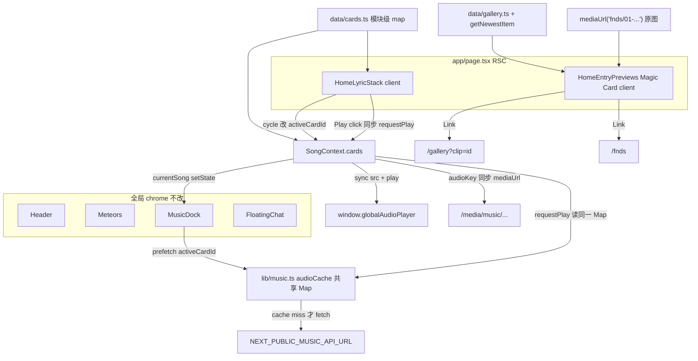

# 首页与 About 改造方案

- 作者：Grok（xAI）
- 日期：2026-08-24
- 状态：Draft
- 目标分支：`cloudflare-worker-DEV`
- 范围：仅首页（`/`）与 About（`/about`）。不包含 FNDS 演出档案数据模型、`/now`、`/music`、博客恢复、AI 聊天或 Admin 改动。
- 仓库：`solidays-worker`（路径 `/Users/francis/Documents/tailwind-nextjs-starter-blog`）

> 实施更新（2026-08-27）：首页歌词卡已按用户补充的歌词扩展为《歌頌》《昨日》
> 《今日》《每一個明天》四张；对应 MP3 已上传至私有 R2 的 `music/` 前缀，并通过
> `/media/music/` 播放。本文下方保留原始分阶段方案，当前实际媒体契约以
> `docs/cloudflare/media-storage.md` 为准。

---

## Overview

当前首页 `app/page.tsx` 是一张静态歌词海报：`CardStack` 用 `data/cards.ts` 里唯一一条《歌颂》卡片撑起 3 层视觉，没有翻面、没有点击、也没有通往 Gallery / FNDS 的入口。`AGENTS.md` 与 `docs/overview/project.md` 明确禁止首页恢复客户端 fetch、自动轮播或数据切换——**本方案明确改写这条约束**。About `app/about/page.tsx` 仍是 starter-blog 简历骨架（Backend Developer、指向模板仓库的 GitHub）加上两段散文，没有回答「这个站为什么存在」。

本轮把首页改成**可翻可点的入口枢纽**：歌词卡在现有 Framer Motion 堆叠上由用户手势循环；正面歌词对应的歌曲驱动已有 Music Dock；卡片下方用 Magic UI Magic Card 给出 Gallery / FNDS 入口。About 用第一人称「我」写 Francis 与这个站的关系，技术说明作为 About 的一个小节保留，不新建 `/colophon` 或 `/lab`。第一轮歌词只带《歌颂》；音频先走现有第三方 API，R2 `music/` 前缀作为后续契约，不阻塞首页改造。

---

## Background & Motivation

### 当前首页

`app/page.tsx` 是 Server Component，把 `defaultCards` 映射成 `CardStack` 的 `items` 后居中渲染：

```7:16:app/page.tsx
      <CardStack
        items={defaultCards.map((card) => ({
          id: card.id,
          name: card.song,
          designation: card.album,
          content: card.content,
        }))}
        stackDepth={3}
      />
```

`data/cards.ts` 只有一条：

| 字段 | 当前值 |
| --- | --- |
| `id` | `0` |
| `song` | `歌颂` |
| `album` | `《Solidays 新曲+精选》` |
| `content` | `风景裡随身听…炼成时代 最亮发声。` |

`components/magicui/CardStack.tsx` 用 `Array.from({ length: Math.max(items.length, stackDepth) })` 画出 3 层：第 0 层是真卡，第 1、2 层是空白框。`motion.div` 只做 `top` / `scale` / `zIndex` 的初始 `animate`，没有 `useState`、没有点击、没有 interval。Magic UI 原版的自动轮播在本仓库已被刻意拿掉。后层与正面同尺寸，靠 `top: index * -CARD_OFFSET` 从**上方**露出一截——后层若也可点，会点到错误的卡。

`contexts/SongContext.tsx` 注释写明「Keep the music lookup aligned with the single static card shown on the homepage」，`cards` 恒等于 `defaultCards`。`SongProvider` 每轮 render 都新建 `value={{ ... }}` 对象，并用 400ms interval 去 attach `window.globalAudioPlayer`。`components/site/MusicDock.tsx` 在 `NEXT_PUBLIC_MUSIC_API_URL` 有值时，按**全部** `card.song` `Promise.all(fetchSongInfo)`，再在 `fetchPlaylist` 里过滤艺人名包含 `陈奕迅` / `Eason` / `Eason Chan` 的结果（过滤**不在** `fetchSongInfo` 内部）。env 未设置且 playlist 为空时 `return null`，Dock 不出现。`useState(true)` 的 `loading` 会在每次 layout 挂载时画出「加载音乐中...」，包括 `/about`、`/gallery`。`currentSong` 的 effect 会 `audio.src` + `audio.load()` 且**不** `play()`；`togglePlay` / `nextSong` / `previousSong` 大量 `setTimeout(..., 100)` 再 `play()`。播放走 `window.globalAudioPlayer`，切路由不断。Gallery Lightbox 已通过 `useSongContext().pause` 在视频 `play` 时暂停 Dock（Lightbox `autoPlay: false`，`preload: 'metadata'`）。

### 当前 About

`app/about/page.tsx` 左侧：`mediaUrl('profile/avatar.jpg')`、Francis、**Backend Developer**、硬编码 Email、硬编码 GitHub `https://github.com/francis1104/tailwind-nextjs-starter-blog`。右侧两节：`Behind Solidays`（技术栈）和一段偏概念化的 Fear And Dreams 介绍。`data/siteMetadata.js` 的 `github` 字段与 About 硬编码 URL 目前相同，但 About 没有读取 `siteMetadata`，简历腔身份与站点实际内容脱节。

### 现有约束（本方案要改写的部分）

`docs/overview/project.md`：

- 首页固定使用 `data/cards.ts` 中的一条默认卡片；首页不再请求 `/api/cards`。
- CardStack 保留 3 层静态堆叠：1 张真卡 + 2 个空白后层，不自动轮播、不做数据切换。
- 不要恢复客户端 fetch、本地镜像状态或自动轮播。

`AGENTS.md` 模块图把 `/` 标成「CardStack 静态卡片堆叠」。同文件还误写 `lib/media.ts`「key 校验」——真实白名单在 `app/media/[...key]/route.ts` 的 `isAllowedMediaKey`。PR4 改模块图时不要把这句错层抄回去。

这些约束来自把首页收成可缓存静态海报的阶段（参见 `docs/incidents/2026-08-15-solidays-win-homepage-client-exception.md`：那次生产事故是 HTML/JS hash 缓存错位，**不是**卡片 fetch 抛错）。本方案允许**用户手势驱动的循环**，仍禁止自动轮播，仍禁止首页客户端请求 `/api/cards`。

### 痛点

1. 首页不是入口：Gallery 与 FNDS 只活在 Header 导航里，新访客看不到站点的两个主要内容面。
2. 歌词与播放脱节：Dock 只在第三方 API env 存在时出现，且按「卡片列表一次性预取」工作；用户无法从卡片选择要听的歌。
3. About 不像这个站：读起来像模板作者简历，而不是 Solidays / 陈奕迅 / FNDS / 游戏为什么会在这里。

---

## Goals & Non-Goals

### Goals

1. CardStack **可翻可点可循环**：用户手势把正面卡送到队尾，后面的卡上前来；继续使用现有 `framer-motion`，不新增 motion 库。
2. 正面歌词驱动 Music Dock：播放必须由用户手势**同步**触发 `audio.play()`；无音频文件时首页仍可浏览歌词，空态画在**卡片 Play** 上。
3. 第一批歌词硬编码在 `data/cards.ts`（或同目录 sibling）；`/api/cards` 继续作为未来 D1 边界，首页不调用它。
4. 首页增加 Gallery、FNDS 入口预览：布局 A + Magic UI **Magic Card** 皮肤；内容契约见附录 B。
5. About 重写为「Francis 和这个站的关系」，叙事第一人称「我」；技术说明留在 About 小节；GitHub / Email 读取已有 `siteMetadata` 字段，**不改**该文件的 URL 值。
6. 写出后续 R2 音频的 object key / `/media` 白名单契约，但不把首页改造阻塞在文件是否已上传。

### Non-Goals

- 不设计 FNDS 演唱会档案数据模型（仍维持 `app/fnds/page.tsx` 内联 7 张静帧）。
- 不设计 `/now`、`/music`、博客恢复、AI 聊天、Admin 改动。
- 不实现本期代码。
- 不新增 npm motion 库。
- 不把 Gallery 视频改走 `/media` 或 `solidays-media`。Gallery 继续用公开桶 `solidays-gallery` / `media.solidays.win`（见 `docs/features/gallery/metadata-processing.md`）。
- 不为首页 Gallery poster 把 `media.solidays.win` 加进 `next.config.js` 的 `images.remotePatterns`。
- 不恢复首页客户端 fetch `/api/cards`。
- 不恢复 CardStack 自动轮播 interval。
- 不改全站 Header、流星背景、FloatingChat 的视觉体系。
- 不公开分发完整商业录音作为「产品功能」；R2 私有 `/media` 只是比公共桶更可控的过渡，版权风险见下文。

---

## Key Decisions

### 1. 第一批歌词硬编码，D1 稍后换

**决定：** 歌词写在 `data/cards.ts`（首页与 SongContext 只 import 这一处）。`app/api/cards/route.ts` 继续 `force-static` + `Response.json(defaultCards)`，作为未来 D1 边界，**首页不 fetch**。

**第一轮只带《歌颂》一条。** 可翻可点先上线（`items.length === 1` 时循环 no-op）。没有正文的歌词不要写入。口述里出现的其它曲目只留在附录 A，**不**进 `data/cards.ts`。

**理由：** 用户已确认第一轮曲目。硬编码零请求、零 D1 绑定、与 `CHAT_DB` 隔离。`docs/cloudflare/resources-and-bindings.md` 已写明不要把卡片写入 `solidays-chat`；若日后迁 D1，应新增独立 `CONTENT_DB`，先改 `/api/cards`，确认稳定后再让首页改为服务端读（不是客户端 fetch）。

### 2. 音频来源：现在走现有 API，稍后走 R2；前缀与封面已定

**决定：** 解析顺序见「Music 解析契约」。有 `audioKey` 则走 `mediaUrl(audioKey)`（私有 `/media`，`lib/media.ts` 只做字符串拼接，**不**做 key 校验）；否则若 `NEXT_PUBLIC_MUSIC_API_URL` 有值，走 `resolveCardAudio`（内含 Eason 过滤）；再否则该卡无音频。Dock 在「没有任何可解析来源且 playlist 为空」时继续隐藏。不 autoplay。

后续 R2（不阻塞 PR1–PR3）也一并定死，不再当 Open Question：

- 桶：现有私有 `solidays-media`
- 音频 key：`music/<slug>.<ext>`，例如 `music/ge-song.m4a`
- 封面 key：同桶 `music/covers/<slug>.jpg`（或 `.webp`）
- 不要用 `fnds/` 或 `profile/` 混放音频，不要给该桶接公开域名

**理由：** 用户稍后才批量下载并上传 R2。第三方 API 已存在于 `MusicDock`，适合当过渡。公开桶放完整商业曲目版权风险更高。封面与音频同桶少一条绑定。

### 3. 循环与播放拆成两种手势；「下一张」是卡片的兄弟节点

**决定：**

- **循环（不播放）：** 点正面卡歌词区（`div` + `onClick`，不是 `<button>`），**加上**卡片堆外侧的兄弟「下一张」控制（lucide `ChevronDown` 或「下一张」文字，本身可以是 `<button>`）。`order.length < 2` 时循环 no-op。PR1 **不做 swipe**，避免与点击抢手势。不要做圆点 pager。
- **播放：** 仅歌名行的 Play 是卡片上**唯一**的 `<button type="button">`。点它才入队并尝试播放。
- 两种手势不得绑在同一个 click 上。
- **happy-path `play()` 必须发生在这次 click 的同步调用栈里**，见下文「手势内播放契约」。禁止把成功播放交给 `useEffect` / `setTimeout`。

**理由：** 读词和听歌是不同意图。绑在一起会变成「每翻一张就出声」。只靠点歌词区不可发现，所以默认就要有外侧下一张控制，而不是等 Open Question 再加。Gallery Lightbox 已经示范「媒体播放是显式行为」。`setState` → `useEffect` 在 commit 之后，Chrome 会当成 autoplay。

### 4. 技术说明留在 About，不新建 colophon / lab

**决定：** 现有 `Behind Solidays` 改为 About 最后一个小节，可改标题，但不拆路由。`app/sitemap.ts` 的 `['', 'gallery', 'fnds', 'about']` **不改**。`data/headerNavLinks.ts` **不改**。

**理由：** 用户已确认。站点现在只有四个展示页，再加一页会稀释 About，也超出本轮范围。

### 5. Gallery / FNDS 预览皮肤：Magic UI Magic Card；布局 A

**决定：**

- 布局 A（堆叠在上，两张预览在下）。
- 默认皮肤：从 Magic UI 复制 **Magic Card**（cursor-following spotlight / 边框高光）到 `components/magicui/magic-card.tsx`，包住 `HomeEntryPreview`。复制方式与现有 `CardStack` / `dock` / `meteors` / `draggable-card` 相同，继续用仓库里的 `framer-motion`，**不**再装一套 `motion` 包。
- 可选极轻量：Magic UI **Glare Hover** 只加在 poster 图上，仅当 Magic Card 仍嫌平。不要叠 Shine Border + Neon Gradient + Border Beam。
- 加载路径锁死（附录 B）：Gallery 原生 ``（或 `next/image` **unoptimized**）+ `galleryUrl` + 480w `posterSrcSet`；**不**用 Next Image Optimization；**不**加 `media.solidays.win` 到 `remotePatterns`；**不** import `GalleryMediaPreview`。FNDS 静帧 **`fnds/01-zhi-ming-ri-de-wu.jpg`（致明日的舞）**，跳过 `variant=card`。
- Gallery 链接：**`/gallery?clip=<id>`**，落地打开 Lightbox；Lightbox **不** autoplay。首页 Network 仍不得请求 Gallery 视频。

**不采用（见「组件站取舍」）：** HeroUI 整套、Cult Hover Video Player、Cult ShiftCard、带 gsap/第二套 3D 的 React Bits、Aceternity 3D Card、安装 `@heroui/*` 或替换 `framer-motion`。

**理由：** 本仓库已经在用 Magic UI 与 shadcn。Magic Card 与 CardStack 同族，不必引入第三套设计系统。Gallery 成品已是 CDN WebP。

### 6. 首页保持 RSC；新增两个小 client 岛

**决定：** `app/page.tsx` 保持 Server Component。本轮新增的 client 组件：

- `components/site/HomeLyricStack.tsx`（歌词循环 + Play）
- `components/site/HomeEntryPreviews.tsx`（Magic Card 要跟踪 pointer，必须 client）

`CardStack` 已经是 `'use client'`；`MusicDock` 已在 `app/layout.tsx` 挂着。不要把整页标成 `'use client'`。

**理由：** Magic Card 的 spotlight 不是 RSC 能做的。仍比整页 client 小。已有 chrome 不算新岛。

### 7. About 人称：「我」；侧栏名称 Francis

**决定：** 叙事用第一人称「我」。侧栏名称仍是 Francis。禁止「Francis 是一位…」传记体。PR3 文案 blocker 已解除；copy source 仍是附录 A。

### 8. GitHub URL 本轮不改

**决定：** About 的 GitHub / Email **读** `siteMetadata.github` / `siteMetadata.email`。**不编辑** `data/siteMetadata.js` 的 URL 值。仓库仍叫 `tailwind-nextjs-starter-blog`。

---

## Proposed Design

### 信息架构

```text
/  （入口枢纽）
├─ Header / Meteors / MusicDock / FloatingChat   ← 全局，不改视觉
├─ HomeLyricStack     可循环歌词卡 + 显式播放（client）
│     └─ 兄弟节点：下一张
└─ HomeEntryPreviews  Magic Card ×2（client）
       ├─ Gallery poster → /gallery?clip=<id>（Lightbox，不 autoplay）
       └─ FNDS still `fnds/01-zhi-ming-ri-de-wu.jpg` → /fnds

/about  （这个站为什么存在）
├─ 侧栏：头像 · Francis · Email · GitHub(siteMetadata)
└─ 正文：站名 → 歌 → 幕后 → FNDS → 游戏 → Behind Solidays
```

### 首页结构



### Card 数据模型

扩展 `data/cards.ts` 的 `Card`。`id` / `song` / `album` / `content` 保持现有语义，首页 `CardStack` 映射不变（`name ← song`，`designation ← album`）。新增字段全部可选，没有 R2 文件时第一批也能上线。

```ts
export type Card = {
  id: number
  song: string
  album: string
  content: string
  /** 默认在解析层视为「陈奕迅」；第三方 API 仍以返回的 artist 为准 */
  artist?: string
  /**
   * 私有 R2 object key，必须落在 /media 白名单前缀下。
   * 例：'music/ge-song.m4a'
   * 未上传时省略；解析器走第三方 API 或判无音频。
   */
  audioKey?: string
  /** 封面 key，例：'music/covers/ge-song.jpg'。可与音频不同批上传。 */
  coverKey?: string
}

export const defaultCards: Card[] = [
  {
    id: 0,
    song: '歌颂',
    album: '《Solidays 新曲+精选》',
    content: '风景裡随身听\n思想裡随心听\n怀著万万万个心的结晶\n炼成时代 最亮发声。',
    artist: '陈奕迅',
    // audioKey / coverKey 等用户上传后再填
  },
]
```

规则：

- `song` 继续当第三方 API 的 `msg` 查询词，也当 UI 曲名。不要在第一批引入独立 `query` 字段，除非用户发现重名。
- `content` 保留 `\n`，UI 继续 `whitespace-pre-line`。
- **第一轮 `defaultCards` 只保留《歌颂》一条。** `items.length === 1` 时循环是 no-op，Play 手势与 3 层视觉仍在。没有正文的歌词不要写进数组。
- `/api/cards` 原样 JSON 序列化扩展后的 `Card`。没有外部调用方（当前仅自身文档约定）；多出来的可选字段可接受。
- **不要**为了第一批去建 D1 migration。

### CardStack 交互 API

把 magicui 组件从「纯视觉」扩成「可循环的堆叠 primitive」，音乐逻辑不进 magicui。

重命名内部类型，避免与 `data/cards.ts` 的 `Card` 撞名：

```ts
'use client'
import { motion, useReducedMotion } from 'framer-motion'

export type CardStackItem = {
  id: number
  name: string
  designation: string
  content: React.ReactNode
}

export type CardStackProps = {
  items: CardStackItem[]
  offset?: number
  scaleFactor?: number
  stackDepth?: number
  /** 正面卡 id 变化时才调用（含初次）。id 未变必须 no-op */
  onFrontChange?: (item: CardStackItem) => void
  /**
   * 仅 Play 按钮调用。实现方必须在这个函数里（或它同步调用的
   * requestPlay 里）对 cache/R2 hit 执行 src + play()。
   */
  onPlay?: (item: CardStackItem) => void
  /** 当前正面卡是否可播。false 时 Play aria-disabled，tooltip「暂无音频」 */
  canPlayFront?: boolean
  className?: string
}
```

行为：

1. 内部 `order: CardStackItem[]`，初始为 `items`。**禁止** `Object.is(items, prev)` 就重置。只在 **ids + 歌词内容** 变化时重置，例如比较 `items.map((i) => \`${i.id}:${typeof i.content === 'string' ? i.content : ''}\`).join('|')`。`data/cards.ts` 是静态模块，但 client 父组件每次 render `map()` 都会得到新数组。
2. 正面 = `order[0]`。可见层 = `order.slice(0, stackDepth)`（这是对当前 `Math.max(items.length, stackDepth)` 画出全部卡的**行为修正**：第一批变多之后，背面只露 `stackDepth - 1` 层）。若 `order.length < stackDepth`，继续补空白后层，保留 3 层海报感。
3. **只有正面层可点。** 非正面真卡与空白后层：`pointer-events-none` + `aria-hidden`。后层从上方露出，否则会点到错误的卡。
4. **循环：** 正面歌词区是 **`div` + `onClick`**，**不是** `<button>` / `role="button"`（Play 已经是 button，不能嵌套）。另有**卡片堆的兄弟节点**「下一张」`<button>`，不放进 Play，也不放进歌词 `div`。容器上 `Enter` / `Space` 循环时必须 `event.preventDefault()`：`app/layout.tsx` 的 `<html>` 有 `scroll-smooth`，空格会滚页。`order.length < 2` 时不改序。算法：`const [front, ...rest] = order; return [...rest, front]`。
5. **播放：** 歌名行 **唯一** `<button type="button">`，lucide `Play`。`onClick` 里 `event.stopPropagation()`，再 `onPlay?.(front)`。无音频时：`aria-disabled`（或 `disabled`）+ `Tooltip`「暂无音频」，**不**调用 `onPlay`。空态画在卡片上，因为无 API、无 `audioKey` 时 Dock 是 `return null`。
6. **动画：** 继续只用 `motion.div` 的 `top` / `scale` / `zIndex`。真卡 `key={card.id}`（不要 `${id}-${index}`）；空白后层可用 `stack-placeholder-${index}`。`useReducedMotion()` 为 true 时 `transition={{ duration: 0 }}`。
7. **禁止：** `setInterval` 自动轮播；第二套动画库；PR1 swipe。
8. **a11y：** 外层 `role="region"` `aria-roledescription="歌词卡片堆"` `aria-label` 含当前 `name`。兄弟「下一张」`aria-label={\`下一张歌词：${next?.name ?? name}\`}`。Play `aria-label={\`播放 ${name}\`}`，无音频时附加「暂无音频」。
9. **`onFrontChange`：** 用 effect 读 `order[0].id`，与上次通知的 id 相同则 **return**，不要 `setActiveCardId` 造成无意义的 SongContext 更新。

### HomeLyricStack：稳定 `items`，不要每 render map

`defaultCards.map(...)` **必须**在模块作用域做一次，或 `useMemo(..., [])`。下面用模块级常量，避免 `useSongContext()` 订阅在 `isPlaying` / 400ms poll 时把堆叠打回《歌颂》。

```tsx
'use client'
import { useCallback } from 'react'
import { CardStack, type CardStackItem } from '@/components/magicui/CardStack'
import { defaultCards } from '@/data/cards'
import { useSongContext } from '@/contexts/SongContext'

const HOME_STACK_ITEMS: CardStackItem[] = defaultCards.map((card) => ({
  id: card.id,
  name: card.song,
  designation: card.album,
  content: card.content,
}))

export function HomeLyricStack() {
  const { activeCardId, setActiveCardId, requestPlay, canPlayCard } = useSongContext()

  const onFrontChange = useCallback(
    (item: CardStackItem) => {
      if (item.id === activeCardId) return
      setActiveCardId(item.id)
    },
    [activeCardId, setActiveCardId]
  )

  return (
    <div className="flex flex-col items-center gap-3">
      <CardStack
        items={HOME_STACK_ITEMS}
        stackDepth={3}
        canPlayFront={canPlayCard(activeCardId)}
        onFrontChange={onFrontChange}
        onPlay={(item) => {
          void requestPlay(item.id)
        }}
      />
      {/* 下一张：卡片的兄弟，不是 Play 的孩子 */}
    </div>
  )
}
```

`app/page.tsx` 只排版：

```tsx
import { HomeLyricStack } from '@/components/site/HomeLyricStack'
import { HomeEntryPreviews } from '@/components/site/HomeEntryPreviews'

export default function HomePage() {
  return (
    <div className="flex min-h-[70vh] flex-col items-center justify-center gap-10 pb-28 pt-4 md:gap-12">
      <HomeLyricStack />
      <HomeEntryPreviews />
    </div>
  )
}
```

`pb-28` 给底部 Music Dock（`fixed bottom-4` + `scale-75`）留空，避免挡住预览。PR1a 可暂不挂 `HomeEntryPreviews`。

### 手势内播放契约（PR1b 的核心，不可用 effect 代替）

`SongProvider.pause()` 已经**同步**碰 `window.globalAudioPlayer`（`contexts/SongContext.tsx`）。`requestPlay` 必须走同一层：由 Play 的 click handler **直接调用**。第一批没有 `audioKey`，真实路径是第三方 API；因此 **cache hit 必须是常见路径**，不能把 `audioCache` 做成 Dock 私有变量。

```ts
type Song = {
  id: string // 稳定：`r2:${audioKey}` 或 `api:${song}`。禁止 Date.now()
  title: string
  artist: string
  url: string
  cover?: string
  source: 'r2' | 'api'
}

type SongContextType = {
  cards: Card[]
  activeCardId: number
  setActiveCardId: (id: number) => void
  /** Dock 与卡片 Play 的当前曲。commitCurrentSong 写这里，不是隐含 playlist[0] */
  currentSong: Song | null
  /**
   * 从 Play click 同步调用。
   * - cache / audioKey hit：在本函数返回前 playSongNow（src + play），
   *   然后 setState currentSong + addToSongQueue（只刷新 UI）。
   * - 正在播放同一 Song.id：no-op，不重播、不 load()。
   * - 无来源：no-op（卡片已 aria-disabled）。
   * - 仅 API miss 可以 await；await 之后仍必须 playSongNow(song)
   *   （先设 src 再 play）。play() reject 时 currentSong 已在 Context 里，
   *   用户再按 Dock Play（那一下仍是手势）。
   * 禁止：setState 一个 nonce，让 MusicDock 的 useEffect 去 play()。
   * 禁止：API miss 分支只调 audio.play() 却不设 src。
   */
  requestPlay: (cardId: number) => void | Promise<void>
  canPlayCard: (cardId: number) => boolean
  songQueue: Song[]
  addToSongQueue: (songs: Song[], currentSong?: Song) => void
  pause: () => void
  isPlaying: boolean
}
```

`canPlayCard(id)`：该卡有 `audioKey`，或 `NEXT_PUBLIC_MUSIC_API_URL` 已设（API 能否命中 Eason 要等 fetch，按钮仍可点；失败后卡片/tooltip 可改为暂无音频，但不在第一次 click 前禁用）。无 key 且无 env 时返回 false——这是第一批《歌颂》在未配 API 时的现实。配了 API 之后，第一张卡的第一次 Play 应尽量走「prefetch 已写入共享 Map」的 cache hit。

**共享缓存（强制）：** `audioCache` 的唯一所有者是 `lib/music.ts`。`MusicDock` 预解析和 `SongProvider.requestPlay` **必须** import 这一个 `Map`。Dock 组件内 `useRef(new Map())` 或 Provider 另起一份都会让每次第一次 Play 变成 miss，并且在删掉 `currentSong` 的 `src`/`load()` effect 之后没有任何地方设 `src`。

同步播放与缓存（`lib/music.ts` 导出；`requestPlay` 只做编排，**不要**把 cache 放进 MusicDock）：

```ts
/** 唯一实例。prefetch 与 requestPlay 都读写它。 */
export const audioCache = new Map<number, Song>()

const inflight = new Map<number, Promise<Song | null>>()

export function playSongNow(song: Song) {
  if (typeof window === 'undefined') return
  const audio = window.globalAudioPlayer ?? new Audio()
  window.globalAudioPlayer = audio
  audio.preload = 'metadata'
  audio.setAttribute('playsinline', 'true')
  audio.crossOrigin = 'anonymous'
  if (audio.src !== song.url) {
    audio.src = song.url
    // 不要在手势路径上调用 audio.load()：会与 play() 竞态
  }
  return audio.play() // 调用方 catch；禁止只 play() 不设 src
}

/** prefetch 与 miss 路径共用，避免 Dock 与 Provider 各 fetch 一次。 */
export function resolveCardAudioCached(card: Card): Promise<Song | null> {
  const hit = audioCache.get(card.id)
  if (hit) return Promise.resolve(hit)
  const pending = inflight.get(card.id)
  if (pending) return pending
  const p = resolveCardAudio(card)
    .then((song) => {
      if (song) audioCache.set(card.id, song)
      return song
    })
    .finally(() => {
      inflight.delete(card.id)
    })
  inflight.set(card.id, p)
  return p
}
```

`SongProvider.requestPlay`：

```ts
function commitCurrentSong(song: Song) {
  setCurrentSong(song) // Context.currentSong
  addToSongQueue([song], song)
}

function requestPlay(cardId: number) {
  const card = defaultCards.find((c) => c.id === cardId)
  if (!card) return

  if (card.audioKey) {
    const song = songFromR2(card) // mediaUrl 是同步字符串拼接
    audioCache.set(card.id, song)
    if (isPlayingSong(song.id)) return
    void playSongNow(song)
    commitCurrentSong(song)
    return
  }

  const cached = audioCache.get(cardId)
  if (cached) {
    if (isPlayingSong(cached.id)) return
    void playSongNow(cached)
    commitCurrentSong(cached)
    return
  }

  if (!process.env.NEXT_PUBLIC_MUSIC_API_URL) return

  // 第一批常见路径：prefetch 尚未写完。仍走同一 Map / inflight。
  void resolveCardAudioCached(card).then((song) => {
    if (!song) return
    if (isPlayingSong(song.id)) {
      commitCurrentSong(song)
      return
    }
    void playSongNow(song)?.catch(() => {
      /* 手势已过；src 已设、currentSong 已提交；Dock Play 是退路 */
    })
    commitCurrentSong(song)
  })
}
```

Dock 预解析（不 play）：`activeCardId` 变化时 `void resolveCardAudioCached(card)`。禁止另建 `Map`。翻卡不打断正在播的歌，也不改 `currentSong`。

`SongProvider` 的 `value` **必须** `useMemo`，依赖含 `currentSong` 在内的实际字段，避免 400ms poll / `isPlaying` 让 `HomeLyricStack` 无意义重渲染。400ms attach 可以留着，但不要让它变成 CardStack 重置的原因。Dock UI 读 `currentSong`，不要在 Dock 里再藏一份「当前曲」作为播放源真相。

### 循环 vs 播放时序

```mermaid
sequenceDiagram
  actor User
  participant Stack as HomeLyricStack
  participant Ctx as SongContext
  participant Cache as lib/music.ts audioCache
  participant Audio as window.globalAudioPlayer
  participant Dock as MusicDock
  participant Src as 第三方API

  User->>Stack: 点歌词区或兄弟「下一张」
  Stack->>Stack: rotate order
  Stack->>Ctx: setActiveCardId 仅当 id 变了
  Ctx->>Dock: activeCard 变化
  Dock->>Cache: resolveCardAudioCached（lib/music.ts，不 play）
  Cache->>Src: 仅 Map miss 时 fetch
  Note over Audio: 正在播的歌不被打断

  User->>Stack: 点 Play 按钮
  Stack->>Ctx: requestPlay(id) 同步（同一调用栈）
  alt audioKey 或 audioCache hit
    Ctx->>Audio: playSongNow：src = url ; void play()
    Ctx->>Dock: currentSong + queue（UI）
  else 同一 Song.id 已在播
    Note over Ctx: no-op
  else 无来源
    Note over Stack: 按钮已 aria-disabled「暂无音频」
  else API miss（prefetch 未完成）
    Ctx->>Cache: 同一 resolveCardAudioCached / inflight
    Cache->>Src: await fetch + Eason 过滤，写入 audioCache
    Ctx->>Audio: playSongNow(song)（先 src 再 play）
    Ctx->>Dock: commitCurrentSong
    Note over Dock: play() reject 则用户再按 Dock Play；src 已在元素上
  end
```

循环**不得** pause / 切当前正在播放的歌。用户可能一边听《歌颂》一边翻到别的词。Play 才把该卡对应的歌设为 **current** 并播放；`addToSongQueue` 是次要的。

### Music Dock 外科手术清单（PR1b）

`components/site/MusicDock.tsx` 约 692 行，已知 hook lint（`docs/development/local-development.md`）。PR1b 按文件改，不要「读完全文件再即兴」。

新增 `lib/music.ts`（播放缓存与解析的**唯一**模块）：

```ts
import { mediaUrl } from '@/lib/media'
import type { Card } from '@/data/cards'

export const audioCache = new Map<number, Song>()

function isEason(artist: string) {
  return (
    artist.includes('陈奕迅') ||
    artist.includes('Eason') ||
    artist.includes('Eason Chan')
  )
}

/** 现有 fetchSongInfo 不含 Eason 过滤；过滤必须进本函数，禁止原样复制后播非 Eason。 */
export async function resolveCardAudio(card: Card): Promise<Song | null> {
  if (card.audioKey) {
    return songFromR2(card)
  }
  const raw = await fetchSongInfo(card.song)
  if (!raw || !isEason(raw.artist)) return null
  return { ...raw, id: `api:${card.song}`, source: 'api' }
}

export function songFromR2(card: Card): Song {
  return {
    id: `r2:${card.audioKey}`,
    title: card.song,
    artist: card.artist ?? '陈奕迅',
    url: mediaUrl(card.audioKey!),
    cover: card.coverKey ? mediaUrl(card.coverKey) : undefined,
    source: 'r2',
  }
}

// 另导出 playSongNow、resolveCardAudioCached（见上节完整签名）
```

`MusicDock.tsx` 必改项：

1. **抽出** `fetchSongInfo` 与 Eason 过滤到 `resolveCardAudio`。删除 Dock 内「`Promise.all` 全部 `card.song` 再 filter」的 `fetchPlaylist` 启动路径。
2. **停止 N 预取。** 只对 `activeCardId` 调用 `resolveCardAudioCached`（`lib/music.ts` 的共享 `audioCache`）。禁止 Dock 自建 Map。翻卡不打断正在播放的歌、不改 `currentSong`。
3. **闸住或删除** `currentSong` 的 `src` + `load()` effect（现 326–333 行）。它会盖掉手势路径上的 `play()`。若仍需在「非手势、仅恢复 UI」时同步 `src`，条件必须是：`audio.src !== currentSong.url` **且** 当前没有一次进行中的手势 `play()`。手势路径禁止 `load()`。
4. **卡片 Play 禁止 `setTimeout(play)`。** 现有 `nextSong` / `previousSong` / `togglePlay` 里的 `setTimeout(..., 100)` 可标为已知债留到本 PR 之外，但**不得**用于卡上 Play。
5. **隐藏规则**改为：

```ts
const hasLocalAudio = cards.some((card) => Boolean(card.audioKey))
if (!musicApiUrl && !hasLocalAudio && playlist.length === 0) return null
```

6. **`loading` 不得在无事可 fetch 时以 `true` 起步。** `useState(!musicApiUrl && !hasLocalAudio ? false : ...)` 或仅在真正发出 API 请求时设 true。禁止在 `/about`、`/gallery` 因 layout 挂载 Dock 而闪「加载音乐中...」。无 API、无 `audioKey` 时直接 `return null`，连 loading 行都不要。
7. **Play vs 队列：** 卡片 Play 经 `commitCurrentSong` 写入 Context 的 **`currentSong`** 并 `playSongNow`；`addToSongQueue` 只是把这首放进队列（去重见下）。Dock 展示 `currentSong`，不是「先入队再等 Dock 自己挑一首」。
8. **同一 `Song.id` 第二次 Play：** 若已经在播这首，no-op。不要靠 nonce 重触发 effect。
9. **Dock Play 退路：** 读 `currentSong.url`（或 `audio.src`，两者应已被 `playSongNow` 对齐）。无 `currentSong` 时不要对空 `Audio` 调 `play()`。

Gallery 暂停：保持 `GalleryLightbox` 现有 `document play` 捕获 + `pause()`。不要改这条。

改播放逻辑时顺手消掉本次碰到的 hook warning，不要把旧 warning 当新功能失败。

### R2 音频契约（文件可后到）

后续上传，不阻塞 PR1–PR3。前缀已在 KD2 定死。

| 项 | 约定 |
| --- | --- |
| 桶 | 现有私有 `solidays-media`（`MEDIA_BUCKET`）。不要用 `solidays-gallery`，不要给媒体桶接公开域名。 |
| 音频 key | `music/<slug>.<ext>`，例如 `music/ge-song.m4a` |
| 封面 key | 同桶 `music/covers/<slug>.jpg`（或 `.webp`） |
| slug | 与 `Card.audioKey` 完全一致；用 ASCII slug，不用中文文件名。 |
| `/media` 白名单 | **今天** `app/media/[...key]/route.ts` 的 `isAllowedMediaKey` 只允许 `fnds/` + `profile/`。**计划中**扩到 `^(?:fnds\|profile\|music)/`。`lib/media.ts` 不校验 key。 |
| Images 变体 | `variant=card` 只用于 FNDS 页卡片静图。音频不得带该 query。首页 FNDS 预览也不带（见附录 B.2）。 |
| Content-Type | 上传时带 `audio/mpeg` / `audio/mp4` / `audio/aac` 等；路由用 `object.writeHttpMetadata`。 |
| Range | `HTMLAudioElement` 常发 `Range`。现有 `/media` 是整对象 `get()`，没有 206。小文件整段加载可能能播；稳定播放需要后续在该路由对 `music/` 做 Range。见风险。 |
| Worker 缓存 | `custom-worker.ts` 的 `isExplicitlyCacheable` 只放行 `image/*`。音频目前会被改成 `no-store`。R2 落地时应把 `audio/*` 且无 `Set-Cookie` 的 `/media/music/*` 纳入可缓存（`max-age=31536000, immutable`）。 |
| 上传 | `wrangler r2 object put solidays-media/music/ge-song.m4a --file ./ge-song.m4a`，然后才把 `audioKey` 写进 `data/cards.ts`。二进制不进 Git。 |

第三方 API 作为过渡：**有 `audioKey` 时禁止再打 API**。

### 队列去重与 localStorage 恢复

今天去重键是 `title + artist`（`SongContext.tsx` 106–108 行），`fetchSongInfo` 的 id 是 `` `${songName}-${Date.now()}` ``，不稳定。`musicQueue` / `musicPlayerState` 会跨会话留下第三方 URL。

**决定：**

- 入队、去重、恢复一律按稳定 `Song.id`（`r2:${audioKey}` / `api:${song}`）。
- 恢复时若某项 `source === 'api'`，且对应卡现在有 `audioKey`，丢掉这项，按 R2 重新 `songFromR2`。即使音频文件本轮还不存在，契约现在就写上。
- 不要用 `title+artist` 把旧 API 行和新 R2 行合成一首却保留第三方 `src`。

### 首页预览布局

三种选项，实现时用 **选项 A** 做默认，布局类名集中在 `HomeEntryPreviews`，方便以后改 grid。

**选项 A（推荐默认）—— 堆叠在上，预览在下，两列。**

```text
        [ CardStack ]

    [ Gallery ]  [ FNDS ]
```

Mobile：预览单列，Gallery 在 FNDS 之上。Desktop：`grid-cols-2`，`max-w` 与 CardStack 的 `md:w-96` 对齐或略宽（`w-full max-w-3xl`）。最保守，不改 `SectionContainer` 的 `max-w-3xl / xl:max-w-5xl`，和现有垂直节奏一致。

**选项 B —— Desktop 三列，Mobile 仍堆叠。**

```text
[ Gallery ] [ CardStack ] [ FNDS ]
```

歌词仍是视觉中心，但 5xl 容器里三列会挤；CardStack 现宽 `md:w-96`，两侧预览会偏小。等用户选了宽卡片组件再考虑。

**选项 C —— 左歌词，右上下两个预览。**

```text
[ CardStack ]  [ Gallery ]
               [ FNDS    ]
```

Desktop 像仪表板，和当前「一张海报居中」的气质差一截；Mobile 退回 A。

预览皮肤锁死为 Magic Card 包一层（KD5）。允许：`components/magicui/magic-card.tsx`（新建，从 Magic UI 复制）、原生 `` 或 `next/image unoptimized`、现有 `Link`。`prefers-reduced-motion` 时关掉 spotlight 跟踪，只留静态边框。禁止：新 npm 动画库、优化版 `next/image`、首页预览自动播 Gallery `preview` mp4、循环视频、拖拽、Cult Hover Video Player。

主题：跟随 `next-themes`。深色下用现有 `dark:` 边框/背景，不要单独做一套 FNDS 黄/粉调（那是 `/fnds` 页 Oswald + `#FBF050` / `#DD345E` 的舞台）。预览里最多用一行小标签复述 `FEAR and DREAMS` 或 `Gallery`，不要把 Oswald 巨字搬到首页。

### 组件站取舍

用户给的站点 + 另外看过的两家。本轮只采用 Magic Card，理由如下。

| 来源 | 结论 |
| --- | --- |
| [Magic UI](https://magicui.design) | **采用 Magic Card。** 仓库已复制 CardStack、dock、meteors、draggable-card、squiggly-text、theme toggler。同族、同 `framer-motion`。 |
| [shadcn/ui](https://ui.shadcn.com) | 已在用（button / tooltip / separator）。预览不必再套一层 shadcn Card。 |
| [Motion](https://motion.dev) | 动画库，不是组件站。仓库已有 `framer-motion`。`AGENTS.md`：不要再装第二套 `motion` 包。 |
| [React Bits](https://www.reactbits.dev) | MagicBento / TiltedCard / SpotlightCard 若拉 **gsap** 或第二套 3D 栈，不用。零额外依赖的 SpotlightCard 只可作为 Magic Card 的**替代**，不能叠加。 |
| [Cult UI](https://www.cult-ui.com) | Hover Video Player 会在首页加载视频，违反 PR2 Network。ShiftCard hover 展开额外 chrome，挨着 CardStack 太忙。 |
| [HeroUI](https://www.heroui.com) | 完整设计系统，和现有 shadcn + Magic UI 打架。不装 `@heroui/*`。 |
| [Aceternity UI](https://ui.aceternity.com) | 与 Magic UI 同族。3D Card / Evervault 太 demo-reel，不适合安静的个人枢纽。Card Hover Effect（压暗兄弟卡）仅当 Magic Card 太亮时作退路，本轮不默认。 |
| [21st.dev](https://21st.dev) | 聚合站，不是一套可落地的系统。 |

### About 页面大纲（只定顺序）

**文案唯一来源是附录 A，不是下面这七条。** 实现时按附录 A 贴正文；本节只定节序。只看本节会漏掉 A.1 的 2008 曲目清单和「红不过罗湖」。

保持现有两栏骨架（侧栏头像 + `prose` 正文），不改 `xl:grid-cols-3`。侧栏身份从简历改成站点作者。

1. **侧栏**
   头像 `mediaUrl('profile/avatar.jpg')`（已在 R2）。名称 Francis。去掉作为主身份的 `Backend Developer`（若保留，放到最后技术小节里一句）。Email / GitHub **读取** `siteMetadata.email` / `siteMetadata.github`，**不要改** `data/siteMetadata.js` 的字段值，除非新增字段。
2. **Solidays 这个名字** ← 附录 A.1（含 2008、《最佳损友》等、「红不过罗湖」）
3. **歌，作为出口** ← A.2
4. **向幕后致敬** ← A.2 后半；C.Y. Kong 与陈辉阳禁止合并
5. **Fear and Dreams** ← A.3；替换现页两段非口述概念文
6. **游戏** ← A.4
7. **Behind Solidays（技术）** ← A.5；不要新路由

人称已定（KD7）：叙事「我」；侧栏 Francis。不要传记体。附录 A 已按「我」整理。

### GitHub / siteMetadata 清理

现状两边都是 `https://github.com/francis1104/tailwind-nextjs-starter-blog`。产品名是 Solidays / Worker 名是 `solidays-worker`，GitHub 仓库仍是 starter 模板名。

已定（KD8）：About **读**现有字段，去掉硬编码。**不编辑** `data/siteMetadata.js`。

---

## API / Interface Changes

### 保持不变

- `GET /api/cards`：仍 `dynamic = 'force-static'`，仍返回 `defaultCards`。首页不调用。
- `GET /media/<key>`：本轮首页代码不改白名单。`music/` 扩白名单是 R2 落地时的后续 diff，写进 PR4 文档与日后实现，不塞进 PR1。
- `GET /gallery?clip=`：已有 `lib/gallery-state.ts` 的 `clipId`。预览深链复用，不改 parser。Lightbox **不会** autoplay。
- `app/sitemap.ts`：不改。
- Chat / Admin / FNDS 拖拽：不改。
- `next.config.js` `images.remotePatterns`：不为本功能添加 `media.solidays.win`。

### SongContext

见「手势内播放契约」。新增 `currentSong: Song | null`（Dock UI 的真相来源）与 `requestPlay`。`cards` 继续来自 `defaultCards` 模块，不在 Context 里 fetch。去掉「single static card」注释。`value` 用 `useMemo`。`audioCache` **不**放在 Context 里，放 `lib/music.ts` 模块单例，避免 Dock 与 Provider 各持一份。

### `/media` 未来签名（文档契约，本轮不实现）

```ts
function isAllowedMediaKey(key: string) {
  return /^(?:fnds|profile|music)\/[A-Za-z0-9._/-]+$/.test(key) && !key.includes('..')
}
```

校验只存在于 `app/media/[...key]/route.ts`。`music/` 下音频对象：忽略 `variant=card`（或对非图像 Content-Type 直接 400 该 variant）。后续 Range 处理只开给 `music/` 音频，避免改 FNDS 图片缓存语义。

---

## Data Model Changes

没有 D1 migration。聊天表不动。

| 数据 | 位置 | 迁移 |
| --- | --- | --- |
| 歌词卡 | `data/cards.ts` | 扩展类型；现有《歌颂》一条保持可渲染 |
| Gallery 预览 | `data/gallery.ts` + `getNewestItem()` | 只读 |
| FNDS 预览 | 首页常量，key 指向已有 `fnds/01-zhi-ming-ri-de-wu.jpg` | 不抽 FNDS 档案模型 |
| 站点元数据 | `data/siteMetadata.js` | About **读取**现有字段；本轮不改文件 |
| 音频对象 | R2 `solidays-media/music/*` | 后到；key 已定 |

`localStorage` 键 `musicQueue` / `musicPlayerState` 保持；身份与失效规则见「队列去重与 localStorage 恢复」。

---

## Alternatives Considered

### A. 首页客户端 fetch `/api/cards`（或直接 D1）

把卡片当动态内容，恢复旧的 client fetch。
**优点：** 以后改词不用发版。
**缺点：** 违反本轮「硬编码第一批」；`CHAT_DB` 不能混用；首页重新变成运行时依赖，和 2026-08-15 之后「首页尽量静态」的方向相反。
**结论：** 不用。D1 只作为 `/api/cards` 后方的未来替换。

### B. 恢复 Magic UI 原版 interval 自动轮播

**优点：** 堆叠「活着」，零点击。
**缺点：** 与读词、显式播放冲突；`prefers-reduced-motion` 不友好；旧约束就是为防这个。用户要的是可翻可点，不是自己转。
**结论：** 不用。

### C. 单击卡片 = 播放，长按或第二按钮才循环

**优点：** 更像播歌。
**缺点：** 长按在触控上难发现；单击出声无法静静看词；autoplay 策略更差。
**结论：** 不用。循环与播放分离；下一张是兄弟控制。

### D. About 拆 `/colophon` 放技术

**优点：** 叙事和技术分开。
**缺点：** 用户已否决；sitemap / 导航要加第五页；技术篇幅短，撑不起一页。
**结论：** 不用。

### E. 音频放 Gallery 公开桶或 `r2.dev`

**优点：** 浏览器 Range / CDN 现成。
**缺点：** 完整商业曲目公开托管，版权风险从「私有源 + 站点播放」变成「任何人拿得到稳定 URL」。`docs/cloudflare/media-storage.md` 明确不要给 `solidays-media` 接公开域名。
**结论：** 不用。过渡用第三方 API（URL 不由本站长期托管），目标态用私有 `/media`。

### F. 预览做成重型自定义 Bento / 3D 卡片，或引入 HeroUI / Cult / 第二套 motion

**优点：** 看起来更「作品」。
**缺点：** 和现有 Magic UI + shadcn 打架；Cult Hover Video 会在首页拉视频；HeroUI 是整套设计系统。
**结论：** 用 Magic UI Magic Card 包 `HomeEntryPreview`，不另装库。

### G. `requestPlay` 只 bump nonce，让 MusicDock `useEffect` 去 `play()`

**优点：** Dock 继续当唯一音频主人，卡片很薄。
**缺点：** commit 后的 effect 不是用户手势，Chrome 会拦 `play()`；卡片 Play 在常见路径上静默失败，只能再按 Dock。
**结论：** 不用。happy path 必须在 click 栈里 `play()`；effect 只更新 UI。

---

## Security & Privacy Considerations

| 威胁 | 说明 | 处理 |
| --- | --- | --- |
| 版权 / 公开完整曲目 | 陈奕迅商业录音不是可再分发资产。公共桶或无过期的公开 URL 等于提供下载。 | 私有桶 + `/media` 白名单；不在文档或页面贴永久直链；不 autoplay；第三方 API 只作过渡。这**不能**把站点变成合法发行方，只降低无控扩散。见风险。 |
| `/media` 路径穿越 | 现有 `..` 拒绝与前缀白名单必须保留。 | 扩 `music/` 时只加前缀，不放宽字符集到任意 unicode 路径。校验留在 route handler。 |
| 第三方音乐 API | 浏览器直出，URL 进 `localStorage` `musicPlayerState`。API 若换 CDN 或带过期 token，恢复播放会失败。 | `crossOrigin = 'anonymous'` 已设。有 `audioKey` 后丢掉 `source==='api'` 的持久化行。不要把 API key 写进新的 `NEXT_PUBLIC_*`。 |
| 预览热链 | Gallery poster 在 `media.solidays.win`（公开）。FNDS 静帧走 `/media/fnds/`。 | 不要在首页引入 Gallery 视频或 preview mp4；不要为优化器登记该 host。 |
| PII | About Email 已公开。口述素材不要新增未提供的私人信息（学校、雇主、真实姓名以外的身份）。 | 附录 A 只整理用户说过的内容。 |

鉴权：首页与 About 保持公开，无 Turnstile。不要把留言用的 Turnstile 挂到播放上。

---

## Observability

首页循环是纯 client state，Worker 无日志可打。需要盯的是音频与 `/media`。

- **现有：** `app/media/[...key]/route.ts` 在 R2 miss 时 `console.error('Failed to read media object from R2', { key, error })`；transform 失败 503。扩 `music/` 后沿用，不要把完整用户 UA 打进 log。
- **建议（R2 落地时）：** 在 `resolveCardAudio` 失败路径用 `console.warn` 记 `{ cardId, source, reason }`，reason 枚举 `not_found | not_eason | network | no_source`，不要记完整第三方 URL query。
- **指标：** 没有现成 analytics。不要为本轮加第三方统计。Cloudflare Observability 已开（`docs/cloudflare/resources-and-bindings.md`）；R2 流量异常（音频远大于 7 张 FNDS 图）靠现有 Worker 指标肉眼看。
- **告警：** 无新告警。若 `/media/music/*` 大量 404，说明 `audioKey` 写了但对象没传，属于发布检查而非 pager。
- **验收：** 本地 `worker:dev` + Chrome DevTools：循环不打 `/api/cards`；未点 Play 时无第三方音乐请求（或仅有当前正面卡的预解析，无 N 倍预取）；Play 的 click 同步栈里出现音频请求（R2/cache hit）；`/about` 不闪「加载音乐中...」；控制台无 error。

---

## Rollout Plan

工作全在 `cloudflare-worker-DEV`。本仓库真实流程是 DEV 提交/推送，生产只接受 DEV 合并（`docs/deployment/release-process.md`）。不要虚构 GitHub org 的环境。

1. **不需要 feature flag。** 控制面就是 `defaultCards.length` 和可选 `audioKey`。一条《歌颂》时循环 no-op，Play 空态与预览仍可先上。
2. **顺序：** PR1a 堆叠手势 → PR1b Dock/播放契约 → PR2 预览（默认布局 A）→ PR3 About → PR4 文档。PR1a 必须同时改掉 AGENTS/overview 里「禁止循环」的那几句，否则后续 agent 会按旧约束把交互改回去。
3. **生产：** 仅当用户明确要求合并 `cloudflare-worker`。首页 HTML 仍受 2026-08-15 同类缓存问题影响：改首页 client 会换 layout/page chunk hash。发布后按 `docs/testing/post-deployment-verification.md` 用 Chrome 打开裸 `https://solidays.win/`（不要只测带 query 的 URL）。
4. **回滚：** DEV 上 revert 对应 commit。1a / 1b / 预览 / About 可单独回滚。无 `requestPlay` 时 Dock 不得自动播。
5. **R2 音频：** 独立后续。先扩白名单与文档，再 `wrangler r2 object put`，再填 `audioKey`。对象未到时 key 不要提前写上（否则 Play 会打 404）。

---

## Risks

| 风险 | 严重度 | 缓解 |
| --- | --- | --- |
| 完整商业曲目无论私有还是第三方，都有版权暴露 | **高** | 不公开桶、不 autoplay、不提供下载按钮、不把音频链到 sitemap。文档写明这是个人站点内的点播，不是发行。若权利方要求下架，删 `audioKey` / 关 `NEXT_PUBLIC_MUSIC_API_URL` 即可让 Play 变成「暂无音频」。 |
| 改约束后 AGENTS 未更新，后续改动把循环删掉 | **高** | PR1a 包含 overview/AGENTS 的外科手术式改写；PR4 收完整模块图。 |
| 把 `play()` 放进 `useEffect` / `setTimeout`，卡片 Play 被当成 autoplay | **高** | happy path 在 click 栈里 `playSongNow`。effect 只刷新 Dock UI。 |
| Dock 私有 `audioCache` 让第一批 API Play 每次都 miss，且 miss 分支不设 `src` | **高** | `export const audioCache` 在 `lib/music.ts`；prefetch 与 `requestPlay` 共用；miss 也走 `playSongNow`。 |
| `items={defaultCards.map()}` 每 render 重置堆叠 | **高** | 模块级 `HOME_STACK_ITEMS`；按 ids/内容签名重置；SongContext `value` `useMemo`。 |
| 浏览器 autoplay 拦截（API miss） | **中** | 仅 miss 路径可能丢手势；退路是 Dock Play。预解析 `activeCardId` 让常见点击走 cache hit。 |
| R2 `/media` 无 Range，音频 seek/流式失败 | **中** | 过渡期继续 API。R2 落地时为 `music/` 做 206，或先只放小文件并验收 Chrome 能否整段播放。 |
| `music/` 未进白名单就写 `audioKey` | **中** | 先扩 `isAllowedMediaKey`，再上传，再写 key。PR1 不要提前写不存在的 key。 |
| 音频未上传，Play 空洞、Dock 隐藏 | **低–中** | 空态在**卡片** Play（`aria-disabled` +「暂无音频」）。首页仍可翻词、点预览。 |
| `currentSong` 的 `load()` effect 盖掉手势 `play()` | **中** | PR1b 闸住或删除该 effect。 |
| 首页新 client JS 导致 chunk hash 与缓存 HTML 不匹配 | **中** | 沿用 `custom-worker.ts` 对非 `/media` 图像的 `no-store`；发布后验证裸 `/`。不要为了首页再开 Workers Cache。 |
| MusicDock 已有 hook lint 与复杂恢复逻辑，改动易回归 | **中** | 按 PR1b 清单改；`localhost:8787` 实测切路由不断歌、Gallery 打开会 pause。 |
| 预览误用 `GalleryMediaPreview` 或优化 `next/image` | **中** | 原生 `` + `galleryUrl`；禁止 Hero/MediaPreview；不加 `media.solidays.win` remotePattern。 |
| `/about` 闪「加载音乐中...」 | **低** | `loading` 默认 false，除非真的发出了 API 请求。 |

---

## Open Questions

产品问题已由用户拍板，见 Key Decisions。实现时不要再改这些。

### 已决事项

| 原题 | 决定 | 落点 |
| --- | --- | --- |
| 预览皮肤 | Magic UI Magic Card；布局 A | KD5 |
| 第一批歌曲 | 只带《歌颂》；无正文的歌词不进 `data/cards.ts`；口述候选只留附录 A | KD1 |
| About 人称 | 叙事「我」；侧栏 Francis；不要传记体 | KD7 |
| FNDS 静帧 | `fnds/01-zhi-ming-ri-de-wu.jpg`（致明日的舞） | KD5 / 附录 B.2 |
| Gallery 落地 | `/gallery?clip=<id>` 打开 Lightbox；Lightbox 不 autoplay；首页不请求视频 | KD5 / 附录 B.1 |
| GitHub URL | About 读 `siteMetadata.github`；不改 `data/siteMetadata.js` | KD8 |
| R2 前缀 | `music/` + 同桶 `music/covers/` | KD2 |
| 循环手势 | 歌词区 + 兄弟「下一张」；不做 swipe | KD3 |

### 仍可选（非 blocker）

1. **Magic Card 若仍嫌平，要不要再加 Glare Hover？**
   只加在 poster 图上。默认先只上 Magic Card。不要叠 Shine Border / Neon Gradient / Border Beam。实现时按观感决定即可，不必再问。

---

## 需同步修改的文档

本方案改写首页约束后，实现时必须改：

| 文档 | 改什么 |
| --- | --- |
| `AGENTS.md` 模块图 | `/` 从「静态卡片堆叠」改为「可循环歌词卡 + Gallery/FNDS 入口预览」；注明用户手势循环，禁止 auto-rotate，禁止客户端 fetch `/api/cards`。**不要**再写 `lib/media.ts` 做 key 校验；白名单是 `app/media/[...key]/route.ts`。 |
| `docs/overview/project.md` | 删除「一条默认卡片 / 不自动轮播、不做数据切换 / 不要恢复客户端 fetch」中与本方案冲突的句子；改为硬编码多卡、手势循环、预览入口。 |
| `docs/cloudflare/media-storage.md` | 白名单句子写成：**今天** `fnds/` + `profile/`；**计划中** `music/`。不要把「Gallery 页面尚未做」这类过时句再抄一遍。 |
| `docs/cloudflare/resources-and-bindings.md` | 可选：卡片仍不是 D1；音频对象计划在 `solidays-media/music/`。 |
| `README.md` | `NEXT_PUBLIC_MUSIC_API_URL`：过渡期歌曲解析，卡片 `audioKey` 优先。标明 `NEXT_PUBLIC_API_URL` **未使用**（只出现在 `.env.example` / README，app 代码不读）。 |
| `app/sitemap.ts` | **不改。** |

`docs/features/home-and-about/remodel-plan.md`（本文）是实现依据。

---

## References

- `app/page.tsx`、`components/magicui/CardStack.tsx`、`data/cards.ts`
- `app/about/page.tsx`、`data/siteMetadata.js`、`data/headerNavLinks.ts`
- `components/site/MusicDock.tsx`、`contexts/SongContext.tsx`
- `app/api/cards/route.ts`、`app/media/[...key]/route.ts`、`lib/media.ts`
- `data/gallery.ts`、`lib/gallery.ts`、`lib/gallery-state.ts`、`lib/gallery-filters.ts`（`getNewestItem`）
- `components/gallery/GalleryMediaPreview.tsx`、`GalleryLightbox.tsx`（`autoPlay: false`）
- `app/fnds/page.tsx`（7 张静帧 key）
- `app/layout.tsx`（`scroll-smooth`）、`custom-worker.ts`（`/media` 仅缓存 `image/*`）
- `next.config.js`（`images.remotePatterns`）
- `AGENTS.md`、`docs/overview/project.md`、`docs/cloudflare/media-storage.md`
- `docs/incidents/2026-08-15-solidays-win-homepage-client-exception.md`
- `docs/features/gallery/gallery-development-plan.md`
- `docs/deployment/release-process.md`、`docs/testing/pre-commit-verification.md`
- `docs/development/local-development.md`（MusicDock hook lint）

---

## Appendix A: About 文案素材

整理自 Francis 口述。为可读性做了分段和标点，**不改成宣传腔，不编造未说过的事实**。实现 About 时以本节为来源；方括号是编辑注，不要进正文，除非用户确认脚注。**不要只按正文大纲七条缩写。**

**人称已定：正文用「我」。** 侧栏写 Francis。不要改成第三人称传记。口语候选曲目（《贝多芬与我》等）只作叙事，不写入 `data/cards.ts`。

人名与写法（按用户原样；仅在有把握时加官方名脚注）：

| 用户原样 | 处理 |
| --- | --- |
| Solidays | 站名与专辑名，保持大小写 |
| 陈奕迅 / Eason | 可并列一次，其后用陈奕迅 |
| C.Y. Kong | 保持此写法。**不是**陈辉阳 |
| 陈辉阳 | 保持。与 C.Y. Kong 分列 |
| 林夕、黄伟文、陈永谦、小克 | 保持中文名，不擅自加英文 |
| Eric Kwok、Jerald | 保持 |
| HazeLight | 正文可写 Hazelight；脚注：官方为 Hazelight Studios。用户口头是 HazeLight |
| 《双人成行》 / It Takes Two | 中英都保留 |
| Francis | 站点作者本人；不要写成第三人称传记主角 |

### A.1 站名

Solidays 是一个合成词，也是我最喜欢的粤语歌手陈奕迅（Eason）的一张专辑。字面是 solid（坚实）和 day。我把它理解为很踏实、很充实的那些日子。专辑是 2008 年的。里面有很多经典：《最佳损友》《富士山下》《浮夸》《葡萄成熟时》。

有人调侃香港歌手「红不过罗湖」。粤语对普通话母语的听众触达更弱，但这些歌在内地同样脍炙人口。

### A.2 歌

除了这些经典，我最喜欢的几首里包括《歌颂》——一首歌颂「歌」的歌。无论开心还是沮丧，处在什么样的人生状态，都可以找到一首歌来表达当时的心情；这世界上也有其他人和你分享开心或不开心。歌词：「感谢永远有歌把心境道破」。歌曲是很多人的情绪出口，在人生中占很大地位。

这让我想到陈奕迅另一首「歌颂歌的歌」：《贝多芬与我》。歌曲贯穿人的一生：摇篮曲、字母歌、流行曲、挽歌，在不同维度伴随着人。

我高中开始听陈奕迅，先是普通话（比如《你的背包》）和前面那些流行粤语，后来越听越对胃口。也明白这不只是歌手一个人的功劳，开始了解作词人、作曲人，例如林夕、黄伟文、陈永谦、小克，以及 C.Y. Kong、陈辉阳、Eric Kwok、Jerald，还有音乐行业里各种幕后工作者。向他们致敬。

### A.3 Fear and Dreams

我喜欢现场，也听过很多不同歌手的现场。FNDS 最大的区别还是那个词 solid。中间 talking 很少，整场非常连贯。陈奕迅把演唱会当成戏剧或电影来做，完整、流畅、沉浸。选曲对大多数人比较冷门，但贴合主题。前半场 Fear：死亡、离别、战争、未知，任何恐惧；后半场 Dreams：希望、爱。很厉害的一场演出。

建这个站，是想让别人了解到这些歌曲，了解到这场演出。

### A.4 游戏

最早可追溯到「玩不了游戏的时候」。人总会被年少不可得之物所困其身。以前很喜欢但玩不了，造就了现在比较沉浸于游戏中的世界。在这些世界里感受到很多不一样的东西。

游戏像其他艺术作品一样——一首歌、一幅画、一场电影、一场演出。你可以通过操作游戏中的人物来和制作者交流，了解他们想告诉你的事情。

典型例子是年度游戏《双人成行》（It Takes Two）。故事：两个快要离婚的人，阴差阳错变成玩偶，在合作中沟通、了解、配合，挽救破裂的关系。制作组 Hazelight［用户说 HazeLight；官方名 Hazelight Studios］本身做过双人合作模式，在《双人成行》里关卡和玩法设计已经非常成熟，能获奖也是之前积累得很深。那些奇思妙想带给别人不一样的体验。

### A.5 现有技术段（可沿用，放最后一节）

这个站点是一个持续生长的个人空间，记录我正在做的事情，也记录我如何把它们做出来。它使用 Next.js、React、TypeScript、Tailwind CSS 和 Framer Motion 构建，运行在 Cloudflare Workers 上，并通过 OpenNext 部署。媒体内容存放在 R2，匿名留言使用 D1 持久化，再由 Durable Objects 和 WebSocket 提供实时同步。页面中的卡片、拖拽、主题切换和各种动效，则是在 Magic UI、shadcn/ui 与自定义组件的基础上逐步调整完成的。它不只是一个页面集合，也是一个用来实践全栈开发、交互设计和产品想法的小型实验场。

［现页里「Backend Developer」是模板身份，不要作为 About 主标题。若要保留职业信息，放进这一节末尾一句即可，不要写进侧栏主身份，除非用户要求。］

### A.6 不要写进页面的编辑提醒

- 不要把 C.Y. Kong 与陈辉阳写成一个人，也不要「纠正」成同一人的中英对照。
- 不要补充用户没点名的专辑曲目、巡演场次、游戏通关年份。
- 不要把「红不过罗湖」改成更「得体」的说法。
- 当前 About 里 Fear 段的「末世、废墟、污染、扭曲、压迫感」等视觉清单**不是**这次口述来源；重写时以 A.3 为准，不要和旧模板段落拼成一篇新文章。

---

## Appendix B: 首页预览内容契约

`HomeEntryPreview` 的 props 即契约。默认皮肤是 Magic Card 包一层（`components/magicui/magic-card.tsx`）+ 原生 `` poster + 标题/meta + 整卡 `Link`。字段不要悄悄变。

```ts
export type HomeEntryPreviewData = {
  href: string
  kicker: string
  title: string
  meta?: string
  imageSrc: string
  imageAlt: string
  imageWidth: number
  imageHeight: number
  sizes: string
  srcSet?: string
  imageKind: 'gallery-poster' | 'fnds-still'
}
```

### B.1 Gallery

| 字段 | 规则 |
| --- | --- |
| 数据源 | `data/gallery.ts` 的 `galleryItems`，用 `getNewestItem()`（`lib/gallery-filters.ts`：按 `recordedAt` 降序，其次 `id` 降序）。不要手写一条 featured id，除非用户指定。 |
| 画面 | **只显示 poster。** 与 Gallery 页同一路径：原生 ``（允许 `next/image` **unoptimized**，禁止优化器）。`src={galleryUrl(item.poster)}`；`srcSet` 用 `posterSrcSet` 里 **480w** 那档（`galleryUrl(source.src)` + `` `${url} 480w` ``）。`imageKind: 'gallery-poster'`。容器 16:9 + `object-cover`。 |
| 禁止 | 不得渲染 `<video>`；不得 import `GalleryMediaPreview` / `GalleryHero`（前者会在 pointerenter 后 200ms 请求 `item.preview` mp4）；不得 preload Gallery mp4；不得把 `media.solidays.win` 加进 `next.config.js` `images.remotePatterns`。 |
| kicker | `Gallery` |
| title | `item.game ?? item.title` |
| meta | `formatClipDate(item.recordedAt)`；可选加 clip 总数，取 `galleryItems.length`。 |
| href | **`/gallery?clip=${item.id}`**。落地打开 Lightbox（`parseGalleryUrl` / `lightboxId`）。Lightbox **不 autoplay**（`autoPlay: false`，`preload: 'metadata'`）。进入 `/gallery` 后可以拉该 clip 的 mp4 元数据，那是 Gallery 页，不是首页。 |
| 加载 | `loading="lazy"`（在首屏 CardStack 之下）。Gallery 图在 `https://media.solidays.win`，Worker 不绑定该桶。 |
| 失败 | poster 404 时保留 kicker + title + 链接，不要让整块预览卸载。 |

### B.2 FNDS

| 字段 | 规则 |
| --- | --- |
| 数据源 | 不新建档案模型。首页常量指向 `app/fnds/page.tsx` 已有 key：**`fnds/01-zhi-ming-ri-de-wu.jpg`（致明日的舞）**。 |
| 画面 | `mediaUrl('fnds/01-zhi-ming-ri-de-wu.jpg')`。**不要**走 `mediaImageLoader` / `variant=card`：Images Binding 会按 1:1 `fit=cover` 裁切，和首页 16:9 槽冲突。与 About 头像相同：`next/image` + `unoptimized`（或原生 ``）吃 `/media` 原图。容器可仍是 16:9 + `object-cover`。若不想裁 16:9，按 `imageKind === 'fnds-still'` 改用接近原图的比例，不要为了 16:9 去请求正方形变体。 |
| 禁止 | 不在首页挂 `DraggableCardBody`；不把 7 张都摆上来。 |
| kicker | `FNDS` 或 `FEAR and DREAMS` |
| title | 建议 `Fear and Dreams`；caption/meta 可用静帧标题 `致明日的舞`。 |
| href | `/fnds` |
| 加载 | `loading="lazy"`。 |
| 失败 | 与 Gallery 相同：保留文字和链接。 |

### B.3 共用规则

- 默认皮肤：`MagicCard` 包住整卡。整卡仍是一个 `Link`（`components/site/Link.tsx`），不要再套一层 button。
- `prefers-reduced-motion` 时 Magic Card 不做 pointer spotlight。
- 不在预览里放 Music Dock 控件。
- 预览区 `z-index` 低于 Dock（`z-50`）和聊天。
- 不修改 `SectionContainer` 的 max-width（已定布局 A）。
- **PR2 Network 硬断言（首页 `/`）：** 无 `gallery-phase2` preview mp4，无 `/gaming/*.mp4`。poster `/gaming/*.webp` 或 `gallery-phase2/v2/*-480.webp` 可以。

---

## PR Plan

全部作为 `cloudflare-worker-DEV` 上可独立 review 的提交（或 PR）。生产合并另走 release-process。每条都能单独上 DEV 而不破坏另外三页。

原「PR1」拆成 **1a / 1b**。1a 可翻可点即可合；1b 才碰 692 行 Dock。无音频时 1a 的验收是卡片上的「暂无音频」，不是 Dock 出声。

### PR1a — CardStack + HomeLyricStack

- **标题：** `首页歌词卡可循环（下一张 + 歌词区），Play 槽位先接上`
- **依赖：** 无。不依赖 R2、不依赖改 Dock。
- **影响文件：**
  - `data/cards.ts`（扩展 `Card`；《歌颂》保留）
  - `components/magicui/CardStack.tsx`（`CardStackItem`、按签名重置 `order`、只渲染 `stackDepth` 层、正面歌词 `div` onClick、后层 `pointer-events-none`、兄弟下一张、Play 为卡上唯一 button、`canPlayFront`、reduced-motion、`onFrontChange` id 未变 no-op）
  - `components/site/HomeLyricStack.tsx`（新增；`HOME_STACK_ITEMS` 模块级常量；Play 可先 stub：无 Context 时 `canPlayFront={false}`）
  - `app/page.tsx`（改为挂 HomeLyricStack；预览可先空缺）
  - `AGENTS.md`、`docs/overview/project.md` 中禁止循环/切换的句子（外科手术式）
- **描述：** 用户可翻卡。`items.length === 1` 时循环 no-op，3 层视觉仍在。禁止 auto-rotate，禁止 fetch `/api/cards`。无音频时 Play `aria-disabled` + tooltip「暂无音频」。
- **验收：** 本地 Worker 打开 `/`：多卡时点歌词区或下一张会换正面，后层露出部分点不到；Space 不滚页；Play 是卡上唯一 button；`HomeLyricStack` 因主题/Dock 重渲染时堆叠不弹回第一张；控制台无 error。

### PR1b — SongContext `requestPlay` + `resolveCardAudio` + MusicDock

- **标题：** `卡片 Play 在用户手势内播歌，Dock 改为按需解析`
- **依赖：** PR1a（Play 槽与 `HomeLyricStack`）。不依赖 R2 文件。
- **影响文件（按文件核对，不要即兴改 692 行）：**
  - `lib/music.ts`（新增：`export const audioCache`、`playSongNow`、`resolveCardAudioCached`、`songFromR2`、`resolveCardAudio` = fetchSongInfo **+** Eason 过滤、稳定 `Song.id`）
  - `contexts/SongContext.tsx`（`activeCardId`、`currentSong: Song | null`、`requestPlay`：hit 同步 `playSongNow`，miss 也 `playSongNow` 不是裸 `audio.play()`、`canPlayCard`、`value` 的 `useMemo`、按 `Song.id` 去重；恢复时丢掉已被 `audioKey` 取代的 `source==='api'` 行）
  - `components/site/MusicDock.tsx`：
    1. 删除全量 `Promise.all` 预取
    2. 只对 `activeCardId` 调 `resolveCardAudioCached`（同一 `audioCache`，不 play）
    3. 闸住/删除本地 `src`/`load()` effect
    4. 卡片 Play 不走 `setTimeout(play)`（next/prev 超时可留作已知债）
    5. hide 规则含 `audioKey`
    6. `loading` 无请求时不得为 true，`/about` 不闪「加载音乐中...」
    7. UI 读 Context `currentSong`；队列为辅
    8. 同一 `Song.id` 再点 Play = no-op
    9. Dock Play 退路依赖已设好的 `src` / `currentSong.url`
  - `components/site/HomeLyricStack.tsx`（接 `requestPlay` / `canPlayCard`，去掉 stub）
- **描述：** cache/`audioKey` hit 时 click 栈里 `playSongNow`。API miss（第一批无 `audioKey`）await 同一 `resolveCardAudioCached` 后仍调用 `playSongNow`（设 `src` 再 `play`），再 `commitCurrentSong`。setState 只刷新 UI。无 API、无 key 时 Dock 仍 `return null`，空态留在卡片。
- **验收：** 有 API 时：翻到一张卡后等 Network 出现一次歌曲 API，再点 Play，断点应落在 click 栈的 `playSongNow`（cache hit），`audio.src` 已是该 URL。若在 prefetch 完成前点 Play：仍应看到 `src` 被设为 API URL，而不是对空 `Audio` 调 `play()`。`audioKey` hit 同样 click 同步。翻卡不打断已在播的歌；同一首歌第二次 Play 不重头；Gallery Lightbox 仍 pause Dock；切 `/about` 不出现「加载音乐中...」；未点 Play 时无 N 倍第三方预取。

### PR2 — 首页 Gallery / FNDS 入口预览

- **标题：** `首页加入 Gallery 与 FNDS 入口预览（布局 A）`
- **依赖：** PR1a 的 `app/page.tsx` 结构；不依赖 CardStack 多卡，不依赖 1b 出声。
- **影响文件：**
  - `components/magicui/magic-card.tsx`（从 Magic UI 复制 Magic Card）
  - `components/site/HomeEntryPreview.tsx`（Magic Card 包一层 + 原生 `` + 标题/meta + `Link`）
  - `components/site/HomeEntryPreviews.tsx`（client；读 `getNewestItem` + FNDS `fnds/01-zhi-ming-ri-de-wu.jpg`）
  - `app/page.tsx`（堆叠下挂预览，`pb-28`）
- **描述：** 布局 A。Gallery：原生 `` + `galleryUrl` + 480w posterSrcSet，href `/gallery?clip=<id>`。FNDS：`/media` 原图，`unoptimized`，不带 `variant=card`。不改 Header / 流星 / 聊天 / `remotePatterns`。不装新 motion 库。
- **验收：** 首页 Network **无** `gallery-phase2` preview mp4、**无** `/gaming/*.mp4`；两入口可键盘到达；深色/浅色都不破版；Dock 不遮挡预览。

### PR3 — About 重写

- **标题：** `About 改为这个站为什么存在，并去掉简历模板腔`
- **依赖：** 无（可与 PR2 并行）。人称已定「我」。**copy source = 附录 A**，不是大纲七条。
- **影响文件：**
  - `app/about/page.tsx` **only**
- **描述：** 按大纲顺序排节，正文从附录 A 粘贴/微调（第一人称「我」）。必须包含 A.1 的 2008 曲目与「红不过罗湖」。最后一节保留 A.5 技术说明。Email/GitHub 读 `siteMetadata`。**不编辑** `data/siteMetadata.js`。人名按附录 A 表。不新建路由。
- **验收：** `/about` 头像仍走 `/media/profile/avatar.jpg`；GitHub 与 Email 不再硬编码重复；无 `/colophon`；sitemap 仍四条。

### PR4 — 文档对齐（含后续 music 前缀）

- **标题：** `文档：首页改为入口枢纽，About 叙事，R2 music 前缀为后续契约`
- **依赖：** PR1a 已改过的那几句 AGENTS/overview 在本 PR 收成完整模块图，而不是再改行为。
- **影响文件：**
  - `AGENTS.md`（模块图 `/` 与 `/about`、文档地图可加本文链接；纠正「`lib/media.ts` key 校验」，改为 route 白名单）
  - `docs/overview/project.md`
  - `docs/cloudflare/media-storage.md`（**今天** `fnds/`+`profile/`；**计划中** `music/`。不要重复「Gallery 页面尚未做」）
  - `docs/cloudflare/resources-and-bindings.md`（可选）
  - `README.md`（`NEXT_PUBLIC_MUSIC_API_URL` 过渡且 `audioKey` 优先；标明 `NEXT_PUBLIC_API_URL` 未使用）
  - 本文已在 `docs/features/home-and-about/remodel-plan.md`
- **描述：** 实现与文档一致。`app/sitemap.ts` 明确保持不变。`music/` 写成尚未实现的白名单扩展。
- **验收：** 文档不再出现「首页禁止数据切换」这种与代码相反的句子；同时仍禁止 auto-rotate 与客户端 fetch `/api/cards`。

### 刻意不做的后续（非本轮 PR）

- `isAllowedMediaKey` 加上 `music/` + Range + `audio/*` 缓存
- 用户上传音频后填写 `audioKey`
- 按观感给 Magic Card 再叠 Glare Hover（可选，非必须）
- 把口述候选曲目写入 `data/cards.ts`（等用户交出歌词正文）
- 把 `defaultCards` 换成 D1 / `/api/cards` 服务端读取
- 清掉 MusicDock next/prev 的 `setTimeout(play)` 已知债（除非 1b 顺手碰到）
